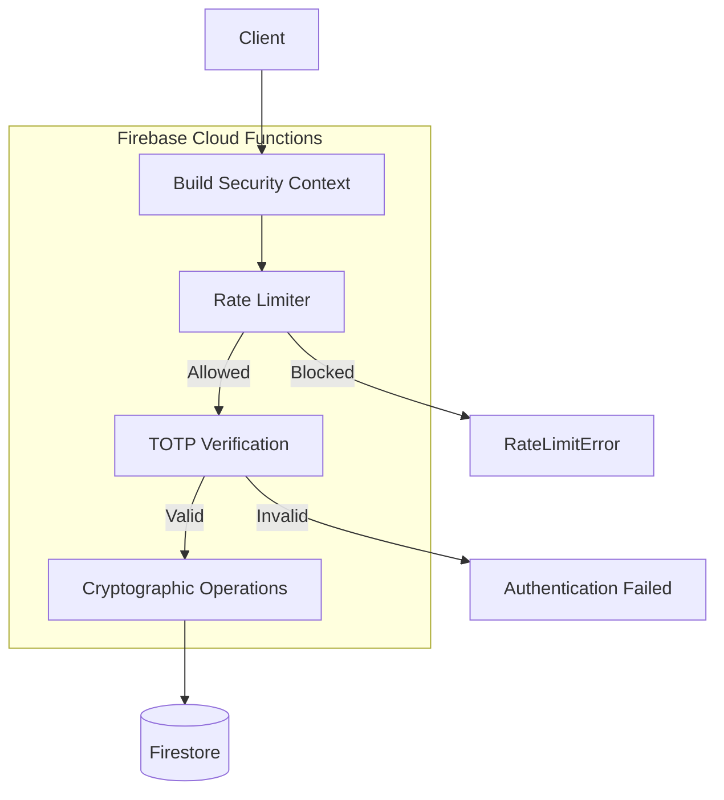
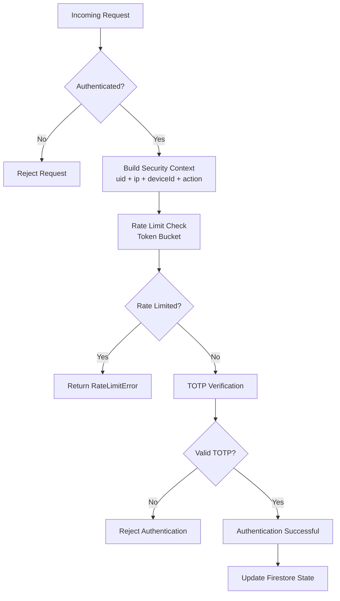

# Security Architecture Overview

## Purpose

This directory describes the security architecture of the system.

It is designed for reviewers to quickly understand:

- how authentication works
- how abuse is prevented
- how sensitive data is protected
- how the system behaves under attack or failure

It is not implementation-level documentation.  
Detailed behavior is split into subsystem documents.

---

## Security Request Flow (Runtime Pipeline | Decision Path)

The system implements a server-side security model for authentication and abuse prevention.

It consists of three core security layers:



### 1. Authentication Layer (TOTP)

Responsible for user identity verification using time-based one-time passwords.

- RFC 4226 (HOTP)
- RFC 6238 (TOTP)
- 30-second time window validation
- cryptographic secret handling

See: `totp-core.md`

---

### 2. Abuse Prevention Layer (Rate Limiting)

Responsible for protecting authentication and sensitive operations from abuse.

Key properties:

- token bucket algorithm
- exponential backoff on abuse
- server-side enforcement only
- Firestore transaction-based atomic updates

Important design decision:

> Rate limiting is context-scoped, not globally user-scoped.

A rate limit bucket is defined by:

```
(useCase, ipHash, deviceHash, action, uid)
```

See: `rate-limiting.md`

---

### 3. Data Protection Layer

Responsible for protecting sensitive data at rest and during processing.

Includes:

- HMAC-based hashing of IP and device identifiers
- secure secret storage for MFA
- cryptographic primitives (HMAC, AES-GCM where applicable)
- trust boundary enforcement

See: `data-protection.md`

---

## C4 Container View (Firebase Security System Structure)

```
User
  |
  v
Firebase Functions (Security Layer)
  |
  +--> TOTP Authentication (RFC-based)
  |
  +--> Rate Limiting System (Token Bucket)
  |
  +--> Data Protection Layer (HMAC / Crypto)
  |
  v
Firestore (State Storage)
```

---

## Security Principles

The system follows these principles:



### 1. Server Authority

All security decisions are made on the server.

Client input is never trusted for:

- authentication decisions
- rate limiting state
- security boundaries

---

### 2. Deterministic Enforcement

Security behavior is deterministic under concurrency:

- Firestore transactions ensure atomic updates
- no race-condition bypass is possible in normal operation
- state transitions are consistent under load

---

### 3. Concurrent Enforcement

Security behavior is consistent under concurrent execution:

- Firestore transactions provide atomic state updates under contention
- race-condition bypass is mitigated in normal operation
- state transitions remain consistent under load

---

### 4. Context Isolation

Security state is isolated per request context:

- user ID (uid)
- IP address (hashed)
- device identifier (hashed)
- action type
- use case

This avoids global lockouts while still limiting abuse per context.

---

### 5. Fail-Closed Security (Critical Paths)

For security-critical operations:

- unexpected system failures result in denial
- bypass is not allowed under degraded conditions

---

## Threat Coverage Summary

The system is designed to mitigate:

- brute-force authentication attacks
- automated bot traffic
- concurrent request exploitation
- distributed abuse across multiple contexts
- identifier exposure in persistent storage

---

## Subsystem Documentation

| Module               | Responsibility                              |
| -------------------- | ------------------------------------------- |
| `totp-core.md`       | RFC-compliant OTP generation and validation |
| `rate-limiting.md`   | Abuse prevention via token bucket system    |
| `data-protection.md` | Cryptographic protection of sensitive data  |
| `threat-model.md`    | Threat analysis and adversary assumptions   |

---

## Important Architectural Note

This system intentionally does **not implement global user-level rate limiting**.

Instead, it uses a **multi-dimensional context model**.

This design choice improves usability (no cross-device lockouts), but requires:

- strong authentication controls (TOTP)
- per-context abuse detection
- atomic server-side enforcement

---

## Reviewer Guidance

If you are reviewing this system:

Start in this order:

1. `totp-core.md` → cryptographic correctness
2. `rate-limiting.md` → abuse prevention model
3. `data-protection.md` → storage + crypto boundaries
4. `threat-model.md` → adversary coverage and residual risk

---

## Summary

The system implements a layered security architecture:

- cryptographic authentication (TOTP)
- contextual abuse prevention (rate limiting)
- cryptographic data protection (HMAC / encryption)
- strict server-side enforcement (Firestore transactions)

All layers are designed to work independently but reinforce each other.
