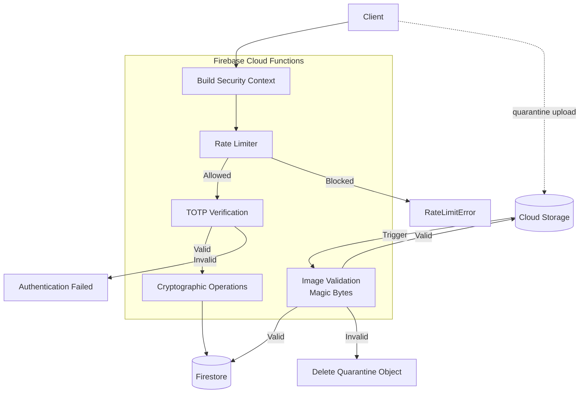
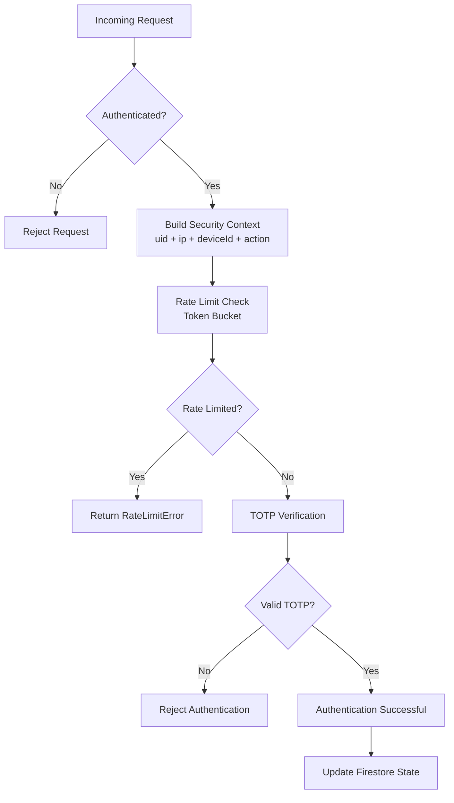

# Security Architecture Overview

## Purpose

This directory describes the security architecture of the system.

It is designed for reviewers to quickly understand:

- how authentication works
- how abuse is prevented
- how sensitive data is protected
- how uploaded content is validated
- how the system behaves under attack or failure

It is not implementation-level documentation.  
Detailed behavior is split into subsystem documents.

---

## Security Request Flow (Runtime Pipeline | Decision Path)

The system implements a server-side security model for authentication, abuse prevention, and content validation.

It consists of four core security layers:


```mermaid
flowchart TD

    Client[Client]

    subgraph Backend["Firebase Cloud Functions"]

        Context[Build Security Context]

        RL[Rate Limiter]

        Auth[TOTP Verification]

        Crypto[Cryptographic Operations]

        ImgVal[Image Validation<br/>Magic Bytes]

    end

    DB[(Firestore)]
    Storage[(Cloud Storage)]

    Client --> Context

    Context --> RL
    RL -->|Allowed| Auth
    RL -->|Blocked| Denied[RateLimitError]

    Auth -->|Valid| Crypto
    Auth -->|Invalid| Reject[Authentication Failed]

    Crypto --> DB

    Client -.quarantine upload.-> Storage
    Storage -->|Trigger| ImgVal
    ImgVal -->|Valid| Storage
    ImgVal -->|Valid| DB
    ImgVal -->|Invalid| Drop[Delete Quarantine Object]
```

### 1. Authentication Layer (TOTP)

Responsible for user identity verification using time-based one-time passwords.

- RFC 4226 (HOTP)
- RFC 6238 (TOTP)
- 30-second time window validation
- cryptographic secret handling

See: `totp-core.md`

---

### 2. Abuse Prevention Layer (Rate Limiting)

Responsible for protecting authentication and sensitive operations from abuse.

Key properties:

- token bucket algorithm
- exponential backoff on abuse
- server-side enforcement only
- Firestore transaction-based atomic updates

Important design decision:

> Rate limiting is context-scoped, not globally user-scoped.

A rate limit bucket is defined by:

```
(useCase, ipHash, deviceHash, action, uid)
```

See: `rate-limiting.md`

---

### 3. Data Protection Layer

Responsible for protecting sensitive data at rest and during processing.

Includes:

- HMAC-based hashing of IP and device identifiers
- secure secret storage for MFA
- cryptographic primitives (HMAC, AES-GCM where applicable)
- trust boundary enforcement

See: `data-protection.md`

---

### 4. Content Validation Layer (Profile Image Quarantine)

Responsible for ensuring that user-uploaded files are validated server-side before they become part of the public surface of the system.

Key properties:

- **Quarantine-first upload model.** Clients can only write to `profilePictures/quarantine/{uid}/{uuid}`. This prefix is non-readable (`allow read: if false`), so no upload is ever served before validation.
- **Server-side byte validation.** A Cloud Function (`validateProfileImage`) inspects the actual magic bytes of each uploaded object. The client-supplied `contentType` header is not treated as a security signal.
- **Format allowlist.** Only JPEG, PNG, and WebP are accepted. All other payloads (including non-images with a spoofed image content type) are rejected and the quarantine object is deleted.
- **Size window.** Files must be larger than 1 KB and smaller than 5 MiB. Both boundaries are enforced server-side and verified by integration tests at the exact limits.
- **UID format validation.** The UID segment of the quarantine path is validated against `^[A-Za-z0-9_-]{1,128}$` before any storage or Firestore access, preventing path traversal and malformed Firestore document references.
- **Promotion to public path.** Validated images are promoted to `profilePictures/{uid}/current.{ext}`, which is the only publicly readable profile-image location. Writes to this path are disabled for clients; only the Admin SDK (used by the Cloud Function) can write here.
- **Cache-busting via generation.** The promoted `photoURL` is written to `Users/{uid}` with a `?v=<generation>` query parameter, so the client always reloads the current image after a successful upload.
- **Cleanup guarantee.** The quarantine object is deleted on every terminal path — success, invalid format, invalid size, invalid UID.

Important design decision:

> `request.resource.contentType` is never trusted as a security signal. Only the actual file bytes determine whether an upload is accepted.

---

## C4 Container View (Firebase Security System Structure)

```
User
  |
  v
Firebase Functions (Security Layer)
  |
  +--> TOTP Authentication (RFC-based)
  |
  +--> Rate Limiting System (Token Bucket)
  |
  +--> Data Protection Layer (HMAC / Crypto)
  |
  +--> Content Validation Layer (Image Quarantine)
  |
  v
Firestore (State Storage)

Cloud Storage (Quarantine + Public Profile Path)
  |
  +--> validateProfileImage (storage trigger)
  |
  v
Firestore (photoURL update)
```

---

## Security Principles

The system follows these principles:


```mermaid
flowchart TD

Req[Incoming Request]

Req --> AuthCheck{Authenticated?}

AuthCheck -- No --> Reject[Reject Request]

AuthCheck -- Yes --> Context[Build Security Context<br/>uid + ip + deviceId + action]

Context --> RL[Rate Limit Check<br/>Token Bucket]

RL --> RLFail{Rate Limited?}

RLFail -- Yes --> Block[Return RateLimitError]

RLFail -- No --> TOTP[TOTP Verification]

TOTP --> TOTPFail{Valid TOTP?}

TOTPFail -- No --> Reject2[Reject Authentication]

TOTPFail -- Yes --> Success[Authentication Successful]

Success --> Write[Update Firestore State]
```

### 1. Server Authority

All security decisions are made on the server.

Client input is never trusted for:

- authentication decisions
- rate limiting state
- security boundaries
- **file content type or validity** (see Content Validation Layer)

---

### 2. Deterministic Enforcement

Security behavior is deterministic under concurrency:

- Firestore transactions ensure atomic updates
- no race-condition bypass is possible in normal operation
- state transitions are consistent under load
- quarantine uploads are validated once, promoted once, and cleaned up once

---

### 3. Concurrent Enforcement

Security behavior is consistent under concurrent execution:

- Firestore transactions provide atomic state updates under contention
- race-condition bypass is mitigated in normal operation
- state transitions remain consistent under load

---

### 4. Context Isolation

Security state is isolated per request context:

- user ID (uid)
- IP address (hashed)
- device identifier (hashed)
- action type
- use case

This avoids global lockouts while still limiting abuse per context.

---

### 5. Fail-Closed Security (Critical Paths)

For security-critical operations:

- unexpected system failures result in denial
- bypass is not allowed under degraded conditions
- **uploads that cannot be validated are not promoted** — the quarantine object is either validated and promoted, or rejected and deleted

---

## Threat Coverage Summary

The system is designed to mitigate:

- brute-force authentication attacks
- automated bot traffic
- concurrent request exploitation
- distributed abuse across multiple contexts
- identifier exposure in persistent storage
- **upload of non-image payloads with spoofed content types (Stored XSS, polyglot files)**
- **path traversal via malicious UID segments in storage paths**
- **oversized or trivial uploads that would consume storage or degrade UX**
- **pre-validation exposure of unverified content to other users**

---

## Subsystem Documentation

| Module                | Responsibility                                     |
| --------------------- | -------------------------------------------------- |
| `totp-core.md`        | RFC-compliant OTP generation and validation        |
| `rate-limiting.md`    | Abuse prevention via token bucket system           |
| `data-protection.md`  | Cryptographic protection of sensitive data         |
| `image-quarantine.md` | Quarantine-based profile image validation pipeline |
| `threat-model.md`     | Threat analysis and adversary assumptions          |

---

## Important Architectural Note

This system intentionally does **not implement global user-level rate limiting**.

Instead, it uses a **multi-dimensional context model**.

This design choice improves usability (no cross-device lockouts), but requires:

- strong authentication controls (TOTP)
- per-context abuse detection
- atomic server-side enforcement
- **server-side content validation for all user-uploaded files**

---

## Reviewer Guidance

If you are reviewing this system:

Start in this order:

1. `totp-core.md` → cryptographic correctness
2. `rate-limiting.md` → abuse prevention model
3. `data-protection.md` → storage + crypto boundaries
4. `image-quarantine.md` → upload validation and promotion pipeline
5. `threat-model.md` → adversary coverage and residual risk

---

## App Check Decision

Firebase App Check with Play Integrity is intentionally **not implemented** at this stage.

The application is currently restricted through an explicit user whitelist. Access to protected backend operations additionally requires authentication and is enforced server-side.

The system already provides multiple abuse-prevention and security controls:

- explicit user whitelist
- server-side authentication
- TOTP-based authentication
- context-scoped server-side rate limiting
- atomic Firestore transaction enforcement
- strict Firestore security rules and ownership checks
- fail-closed behavior on security-critical paths
- **quarantine-based upload validation with server-side byte inspection**

App Check would primarily add an additional attestation layer to verify that requests originate from an authorized application instance.

For the current restricted-access model, this provides limited additional security value compared to the additional native integration complexity required for Play Integrity.

Therefore, App Check is intentionally omitted to keep the security architecture minimal and avoid introducing unnecessary implementation complexity.

This decision should be reconsidered if the application becomes publicly accessible or the threat model changes. In particular, App Check may provide additional value when the application is distributed to an unrestricted user base and backend abuse becomes a larger concern.

---

## Summary

The system implements a layered security architecture:

- cryptographic authentication (TOTP)
- contextual abuse prevention (rate limiting)
- cryptographic data protection (HMAC / encryption)
- **server-side content validation (quarantine + magic-byte inspection)**
- strict server-side enforcement (Firestore transactions)

All layers are designed to work independently but reinforce each other.
