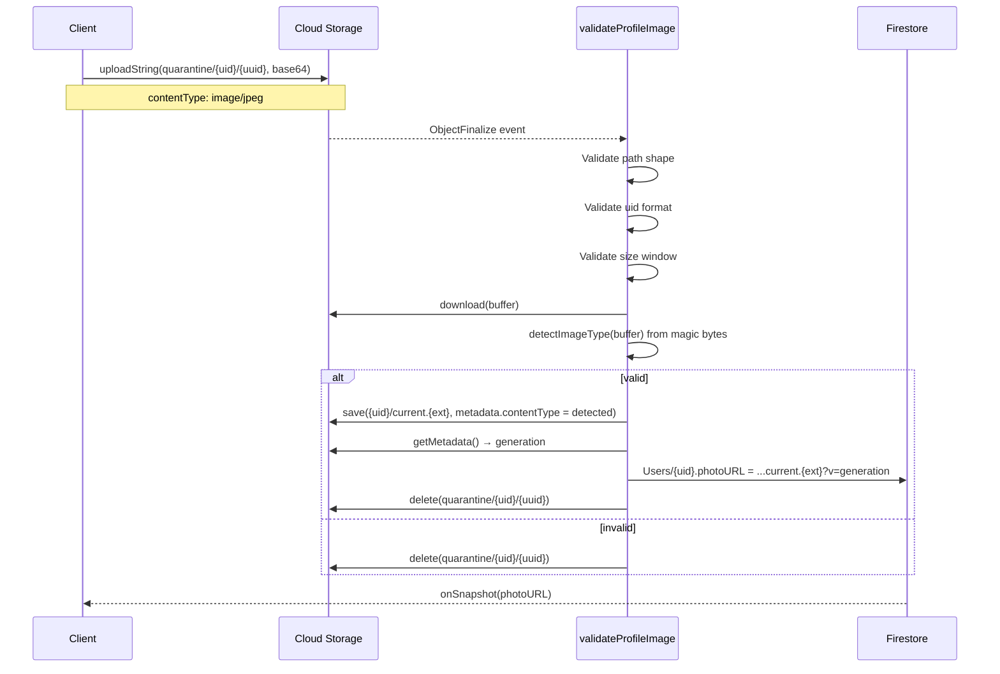

# Image Quarantine

## Purpose

This document describes the quarantine-based profile image upload pipeline.

It is designed for reviewers to quickly understand:

- why profile images are uploaded through a quarantine layer
- how the pipeline validates uploads server-side
- which security guarantees the pipeline provides
- which residual risks remain

It is not implementation-level documentation. The authoritative code is:

- `functions/src/functions/validateProfileImage.function.ts`
- `storage.rules`

---

## Threat Model

The quarantine pipeline exists to mitigate the following threats:

| Threat                      | Description                                                                                                                                           |
| --------------------------- | ----------------------------------------------------------------------------------------------------------------------------------------------------- |
| **Spoofed content type**    | A client uploads arbitrary bytes with `contentType: image/jpeg` and the server trusts the header.                                                     |
| **Stored XSS / polyglot**   | A file is both a valid image and executable content (HTML, SVG, script). When served from a public URL, a browser may interpret it as active content. |
| **Path traversal**          | A malicious `uid` segment (`..`, `/`, control characters) causes writes outside the intended prefix or malformed Firestore document references.       |
| **Storage exhaustion**      | Repeatedly uploading large or trivial files consumes bucket space and Function invocations.                                                           |
| **Pre-validation exposure** | Unvalidated content is publicly readable before the server has had a chance to inspect it.                                                            |
| **Overwrite attacks**       | A user overwrites another user's profile image, or overwrites their own after validation has already begun.                                           |

---

## Storage Layout

Two prefixes exist for profile images:

```
profilePictures/
├── quarantine/{uid}/{uploadId}      ← client-writable, not readable
└── {uid}/current.{ext}              ← public read, client-write disabled
```

| Property     | `quarantine/{uid}/{uploadId}`     | `{uid}/current.{ext}`           |
| ------------ | --------------------------------- | ------------------------------- |
| **Writer**   | Authenticated owner               | Cloud Function only (Admin SDK) |
| **Reader**   | Nobody                            | Public                          |
| **Update**   | Forbidden                         | Forbidden                       |
| **Delete**   | Owner (cleanup)                   | Forbidden                       |
| **Filename** | Random UUID per upload            | Deterministic (`current.jpg`)   |
| **Lifetime** | Until validation completes (~1 s) | Until replaced by next upload   |

The `quarantine/` prefix is deliberately non-readable, even for the owner. This prevents any window in which unvalidated content is served to any party.

---

## Upload Pipeline



### Step-by-step

1. **Client upload.** The client uploads bytes to `profilePictures/quarantine/{uid}/{uuid}` using `uploadString(..., "base64")`. The `uuid` is generated client-side per attempt, so no two uploads collide and no `update` path exists.
2. **Storage Rules gate the write.** Only the authenticated owner (`request.auth.uid == uid`) can create a file under this prefix. Size and content-type are checked as a pre-filter only.
3. **Storage trigger.** The bucket fires an `ObjectFinalize` event. `validateProfileImage` is invoked with the object metadata.
4. **Path shape validation.** The function requires exactly four path segments and the prefix `profilePictures/quarantine/`. Any other path is ignored with no side effects.
5. **UID format validation.** The UID segment must match `^[A-Za-z0-9_-]{1,128}$`. This runs before any storage or Firestore access.
6. **Size validation.** Files must be `> 1024` bytes and `< 5 MiB`. Boundary values are inclusive on the reject side.
7. **Download and inspect.** The function downloads the object and inspects the leading bytes.
8. **Format detection.** Only JPEG, PNG, and WebP are accepted, identified by their magic bytes. The detected MIME type — not the client header — is used for the promoted object.
9. **Promotion.** On success, the buffer is written to `profilePictures/{uid}/current.{ext}` with `contentType` set from the detected format.
10. **Cache-busting.** The new object's `generation` is read and appended to `photoURL` as `?v=<generation>` before it is written to `Users/{uid}`.
11. **Cleanup.** The quarantine object is deleted on every terminal path: promoted, wrong format, wrong size, wrong UID.

---

## Client Behavior

The client is intentionally constrained:

- It cannot write to `profilePictures/{uid}/current.{ext}` — the Storage Rules deny all writes there.
- It cannot read from the quarantine prefix — the Storage Rules deny all reads there.
- It does not write `photoURL` — only the Cloud Function does.
- It does not choose the final file extension — the extension is derived from the detected format.

The client's only role is: pick a file, upload it to quarantine, and observe `Users/{uid}` for changes.

---

## Server Behavior

`validateProfileImage` runs with Admin SDK privileges. It bypasses Storage Rules and Firestore Rules entirely. This means:

- Every input to the function must be validated by the function itself.
- The function never trusts any field on the event except `name` and `bucket`, and even those are validated.
- The function must clean up after itself on every path, including error paths.

### Validation order

The function validates in this order, short-circuiting early:

1. **Prefix.** `objectName` must start with `profilePictures/quarantine/`.
2. **Segment count.** `objectName.split("/")` must yield exactly four parts.
3. **UID format.** Third segment must match the UID pattern.
4. **Size.** `object.size` must be inside the window.
5. **Format.** Downloaded buffer must begin with known magic bytes.

Steps 1–4 are metadata-only. Only step 5 touches the file bytes. This ordering ensures that trivial rejections never require a download.

---

## Storage Rules

The relevant rules are:

```javascript
rules_version = '2';
service firebase.storage {
  match /b/chrono-craft-worktime-manager.firebasestorage.app/o {

    match /profilePictures/quarantine/{uid}/{uploadId} {
      allow read: if false;
      allow create: if request.auth != null
        && request.auth.uid == uid
        && request.resource.size > 1024
        && request.resource.size < 5 * 1024 * 1024;
      allow update: if false;
      allow delete: if request.auth != null && request.auth.uid == uid;
    }

    match /profilePictures/{uid}/{fileName} {
      allow read: if true;
      allow write: if false;
      allow delete: if false;
    }

    match /{allPaths=**} {
      allow read, write: if false;
    }
  }
}
```

Key properties:

- **`allow create`, not `allow write`.** Once a quarantine object exists, it cannot be overwritten. A malicious client cannot swap the file after the trigger has fired.
- **`allow read: if false`.** No read path exists for quarantine content, even for the owner.
- **`allow delete: if owner`.** The owner can abort their own failed uploads.
- **Public read on `{uid}/current.{ext}`.** This is the only exposure surface.
- **Catch-all deny.** Any path not matched above is denied.
- **Explicit bucket scope.** The rules apply only to the project bucket.

---

## Failure Modes

| Failure                               | Behavior                                                                                                               |
| ------------------------------------- | ---------------------------------------------------------------------------------------------------------------------- |
| Path outside quarantine               | Ignored, no side effects                                                                                               |
| UID fails pattern                     | Quarantine object deleted, no Firestore write                                                                          |
| Size ≤ 1024 B                         | Quarantine object deleted, no Firestore write                                                                          |
| Size ≥ 5 MiB                          | Quarantine object deleted, no Firestore write                                                                          |
| Magic bytes unrecognized              | Quarantine object deleted, no Firestore write                                                                          |
| Firestore write fails after promotion | Exception propagates; quarantine object remains (see Residual Risks)                                                   |
| Storage download fails                | Exception propagates; quarantine object remains (see Residual Risks)                                                   |
| Trigger event delivery retried        | Function runs again; second pass may fail at delete (object already gone) — treated as idempotent at the storage level |

---

## Security Guarantees

The pipeline guarantees the following, and integration tests assert each:

- **Format integrity.** A promoted object's content type is always derived from its magic bytes, never from the client header.
- **Path integrity.** UID segments that are not valid Firebase Auth UID shapes are rejected before any I/O.
- **Boundary correctness.** The exact size boundaries (`1024`, `5 MiB`) are rejected; `1025` and `5 MiB − 1` are accepted.
- **No pre-validation exposure.** The quarantine prefix is not readable by any principal.
- **No client-controlled public path.** Clients cannot write to `profilePictures/{uid}/current.{ext}`.
- **No overwrite window.** Once in quarantine, an object cannot be replaced.
- **Deterministic cache-busting.** `photoURL` always includes the storage `generation` of the promoted file.

---

## Residual Risks

The following risks are known and intentionally not addressed in this layer:

| Risk                                                                                                     | Reason                                                                                                                                                      |
| -------------------------------------------------------------------------------------------------------- | ----------------------------------------------------------------------------------------------------------------------------------------------------------- |
| **EXIF metadata.** Uploaded images retain EXIF, including GPS coordinates if present.                    | Stripping requires re-encoding with `sharp` or equivalent, which is a larger change. Out of scope for this pipeline.                                        |
| **Polyglot files.** A file with valid JPEG magic bytes can contain arbitrary trailing content.           | The pipeline promotes such files as JPEG. Browsers honor the `Content-Type` metadata set at promotion time, so trailing content is not interpreted as HTML. |
| **Orphaned quarantine objects.** If the function fails between download and cleanup, the object remains. | Mitigated by a Storage lifecycle rule (out of scope; planned follow-up).                                                                                    |
| **Rate-limiting.** No per-user throttle on quarantine uploads exists at this layer.                      | Addressed (or planned) via the abuse-prevention layer. See `rate-limiting.md`.                                                                              |
| **Function crash on unhandled error.** An unexpected exception leaves the quarantine object in place.    | Same as orphaned objects — mitigated by lifecycle rule.                                                                                                     |

---

## Testing

The pipeline is verified by integration tests in:

`functions/tests/integration/validateProfileImage.integration.ts`

They run against the Firebase Emulator Suite (Firestore + Storage + Functions) and cover:

- happy path (JPEG promoted, `photoURL` written with cache-buster, quarantine cleaned up)
- path traversal in the UID segment
- non-image payloads with spoofed `image/jpeg` content type (PDF, HTML, GIF, ZIP, plaintext)
- path filter (missing prefix, wrong segment count, wrong prefix)
- size boundaries (1024, 1025, 5 MiB − 1, 5 MiB)

See `testing.md` for the full testing strategy.

---

## Reviewer Checklist

When reviewing this subsystem, confirm:

- [ ] Storage Rules match the layout described above.
- [ ] `allow update` is disabled on the quarantine prefix.
- [ ] `allow read` is disabled on the quarantine prefix.
- [ ] The catch-all rule denies everything else.
- [ ] The Cloud Function validates UID format before any I/O.
- [ ] The Cloud Function derives the promoted content type from magic bytes, not from the event.
- [ ] The promoted `photoURL` includes `?v=<generation>`.
- [ ] The quarantine object is deleted on every terminal path.
- [ ] The integration test suite covers the cases listed above.
